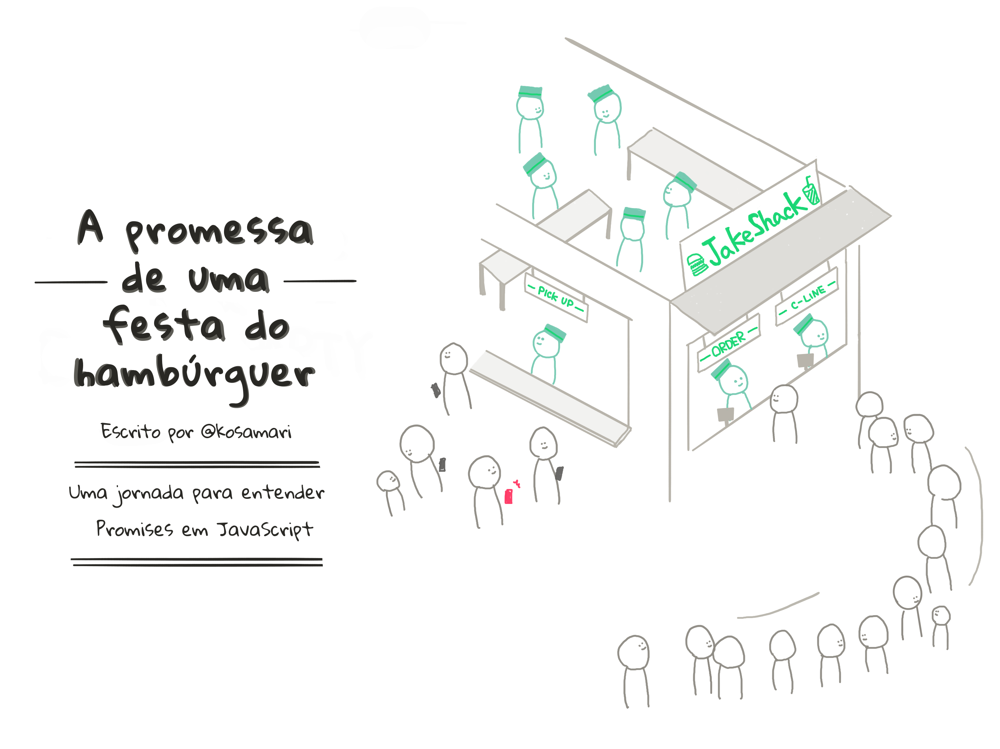
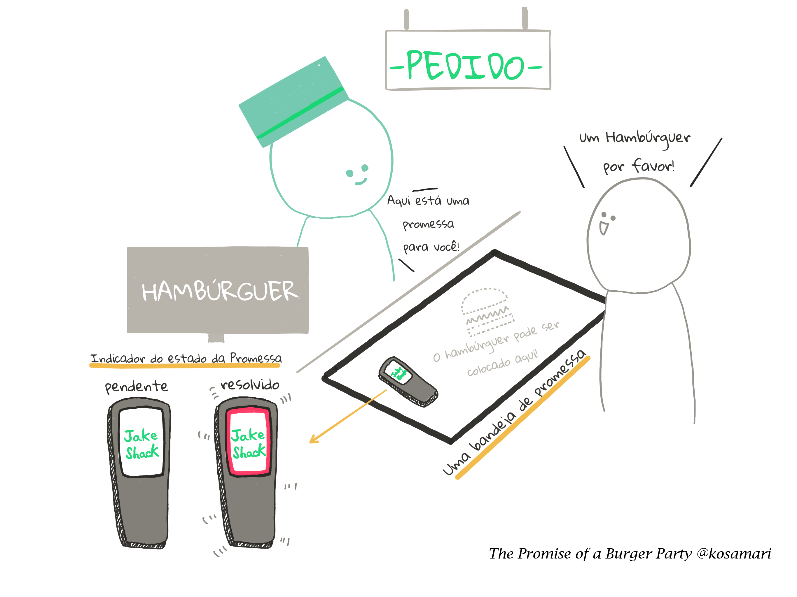
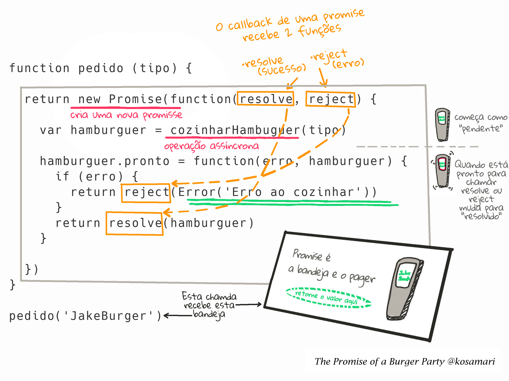
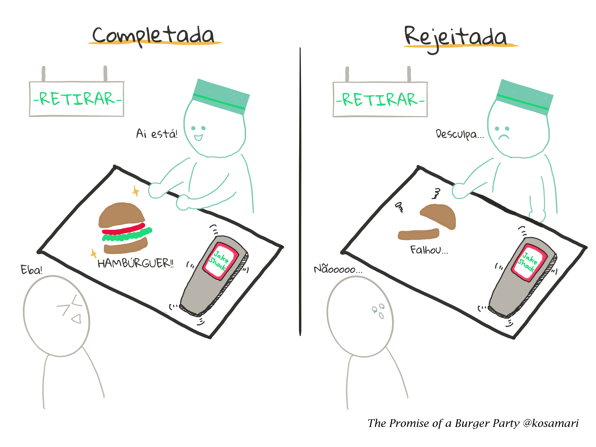
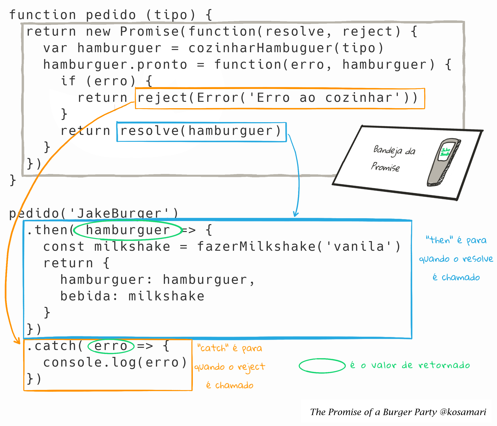
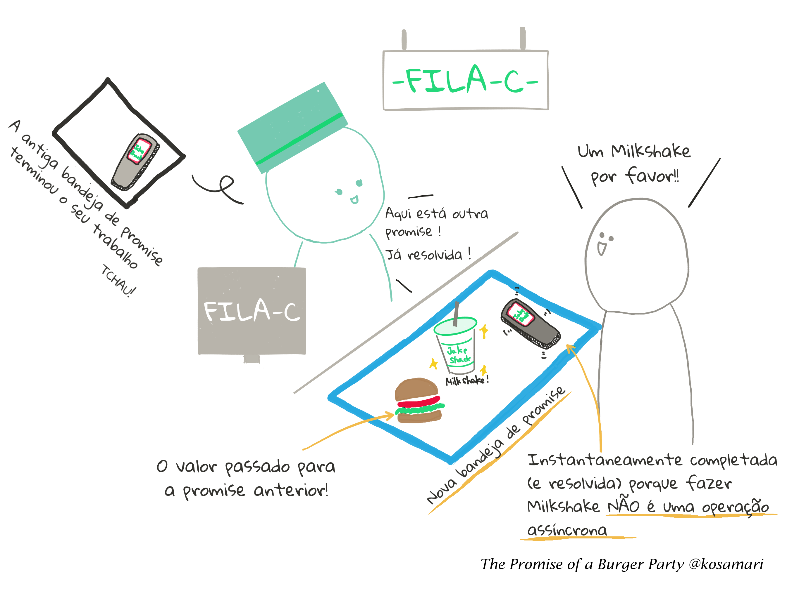
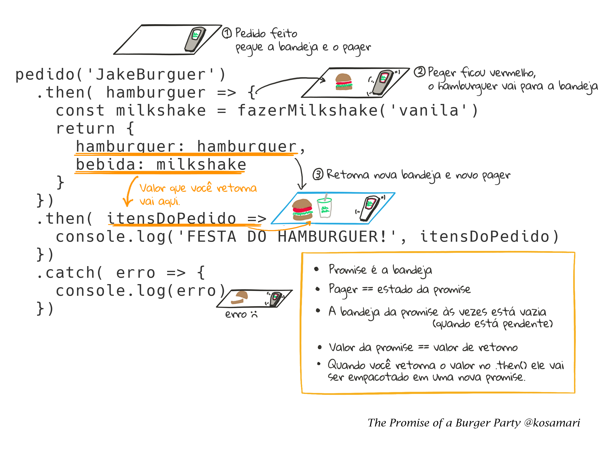

# A promessa de uma festa do hambúrguer
Eu escrevi esse artigo como uma introdução alternativa ao conceito de *promise* em JavaScript. Foi algo que eu esbocei no meu caderno enquanto eu lia vários artigos sobre promises. Se você precisar de um tutorial mais avançado, eu listei sugestões de artigos no fim deste.
👍

Duas semanas atrás, eu estava em uma conversa sobre como implementar uma funcionalidade em JavaScript. Ela precisava ser assíncrona para acessar dados externos, eu disse "bem, vamos usar *fetch()*...então no código... umm..." enquanto eu parei para lembrar sobre a API do fetch, a pessoa com a qual eu estava conversando disse, "Retorna uma promise". Meu cérebro congelou, e eu disse: "Eu honestamente não sei o que você quer dizer".

Eu escrevi códigos baseados em promises várias vezes, mas de alguma maneira as coisas não se conectaram no meu cérebro desta vez. Eu percebi que na verdade eu não entendo promises.

Se você me conhece do twitter, eu sou uma pessoa visual que desenha [conceitos de código](http://https://twitter.com/kosamari/status/806941856777011200) como uma [metáfora física](http://https://twitter.com/kosamari/status/807303762188574720). É como eu consigo lidar com uma dupla camada de abstração (linguagem de programação e inglês como uma segunda língua). Então, naturalmente eu também precisei desenhar dessa vez.



Aqui está um pedaço dó código que iremos olhar nessa história.

```js
// operação assincrona
function cozinharHamburguer (tipo) { ... }

// operação regular
function fazerMilkshake (tipo) { ... }

// função de pedido que retorna uma promise
function pedido (tipo) {
  return new Promise(function(resolve, reject) {
    var hamburguer = cozinharHamburguer(tipo)
    hamburguer.pronto = function (erro, hamburguer) {
      if (erro) {
        return reject(Error('Erro ao cozinhar'))
      }
      return resolve(hamburguer)
    }
  })
}

pedido('JakeBurger')
  .then( hamburguer => {
    const milkshake = fazerMilkshake('baunilha')
    return { hamburguer: hamburguer, bebida: milkshake }
  })
  .then( ingredientes => {
    console.log('FESTA DO HAMBURGUER !', ingredientes)
  })
  .catch( erro => {
    console.log(erro)
  })

```

## Vamos dar uma festa do hambúrguer

Bem-vindo ao Promise Square Park, casa da hamburgueria JakeShack. Os hambúrgueres da JakeSchack são muito famosos, mas eles não possuem muitos atendentes para anotar os pedidos, então a fila é sempre imensa. No entanto, a cozinha é muito bem equipada para preparar múltiplos pedidos ao mesmo tempo.

> Caso você não seja familiar, [Madison Square Park (um parque de Nova Iorque) e ShakeShack (hamburgueria localizada próximo ao parque) são famosos em Nova Iorque](https://kosamari.com/notes/the-promise-of-a-burger-party). É *um lugar muito bom*, mas a fila sempre é grande.

## Transformando a ação em promessa (promises)

Para ser possível anotar pedidos no menor tempo possível, JakeShack utiliza um sistema de pagers. Quando um cliente faz um pedido no caixa, o atendente lhe entrega uma bandeja e um pager.



A bandeja é uma promessa da hamburgueria de que eles irão colocar seu delicioso hambúrger nela quando estiver pronto, e o pager é um indicator do estado do pedido. Quando o pager não está vibrando, isso significa que o pedido está **pendente** - o pessoal da cozinha está ocupado preparando o seu pedido. Quando o pager fica vermelho e vibra, significa que o seu pedido está **resolvido**.

Uma observação: **resolvido** aqui não quer dizer "pronto". Quer dizer que o pedido foi processado na cozinha e os atendentes estão chamando o cliente para tomar uma ação sobre ele. Você (um cliente) provavelmente quer retirar o seu pedido no balcão, mas em alguma situação, você poderia simplesmente ir embora. É uma escolha sua.

Vamos dar uma olhada no código que temos até agora. Quando você chama a função pedido, ela "retorna uma promessa" (lhe entregando uma bandeja e um pager. Um valor de retorno (um hambúrguer) deve aparecer na bandeja assim que a promessa (promise) for cumprida e a função de callback chamada. Vejamos mais na próxima seção!



## Adicionar manipulador de promises

Parece que o pager está apitando, vamos para o balcão pegar o pedido. Existem 2 cenários possíveis que podemos esperar nesse estágio.



## 1. Pedido completada

Eba!!! Seu hambúrguer está pronto, a equipe da cozinha lhe entrega um hambúrguer recém-preparado. A promessa de um bom hambúrguer foi completa!

## 2. Pedido rejeitada

Parece que a cozinha está sem hambúrguers, a promessa de um hambúrguer foi rejeitada. Certifique-se que você receberá um reembolso por isso.

Aqui é como você pode preparar seu código para essas 2 situações.



.then() recebe outra função como segundo argumento que pode ser também usado como um manipulador de rejeição. Para o bem da simplicidade, eu apenas uso .catch() para rejeitar nesse artigo. Se você quiser saber mais sobre a diferença, você pode checar [esse artigo](https://developers.google.com/web/fundamentals/getting-started/primers/promises#error_handling).

## Encadear a Promise

Vamos dizer que seu pedido foi completado, mas você percebeu que para ter uma super festa do hambúrguer, você também precisa de milkshake... então você vai até a fila-C (uma fila especial para bebidas, algo real no ShakeShack para otimizar a fila). Quando você pede um milkshake no balcão, o atendende do caixa lhe dá uma nova bandeja e um outro pager. Já que milkshakes ficam prontos super rápidos, o atendente irá lhe entregar o milkshake também. Não é preciso esperar pelo pager apitar (já está apitando).



Vamos olhar como esse código funciona. Encadear promessas é tão fácil quanto adicionar um .then() no seu código. O retorno de uma .then() é sempre uma promise. Apenas lembre que cada .then() retorna uma bandeja e um pager, e um valor de retorno efetivo é passado como argumento para o callback.



Agora que você tem um hambúrguer e um milkshake, você está pronto para a FESTA DO HAMBÚRGUER.

## Mais truques da festa!

Existem mais alguns métodos em promises que permitem a você fazer truques legais.

Promise.all() cria uma promise que recebe um array de promises (itens).
Essa promise é completada quando todos os seus items (cada um é uma promise) são completados. Imagine que você pediu 5 hambúrgueres diferentes para seu grupo, mas quer minimizar a viagem até o balção para apenas uma, feita quando todos os pedidos estiverem prontos. Promise.all() é uma boa solução para isso.

Promise.race() é similar a Promise.all(). Mas é completada ou rejeitada assim que um dos itens é completado ou rejeitado. Pode ser usado para simular tentar e pegar. Se você estiver com muita fome, você pode pedir um hambúrguer, um hambúrguer com queijo, e um hot dog ao mesmo tempo, apenas para pegar qualquer que seja o primeiro que saia da cozinha. (Nota, nessa analogia se a cozinha estiver sem hambúrguer e rejeitar o hambúrguer primeiro, então toda a race promise terá seu estado rejeitado).

Existem mais detalhes a serem cobertos sobre promises. Aqui está uma sugestão de leitura adicional.

Obrigada ao Jake Archibald and Nolan Lawson por revisar esse artigo e sugerir mudanças! E Chris Wheatley, Juan Lopez, e Nicolas Dermine por arrumar erros de digitação.
